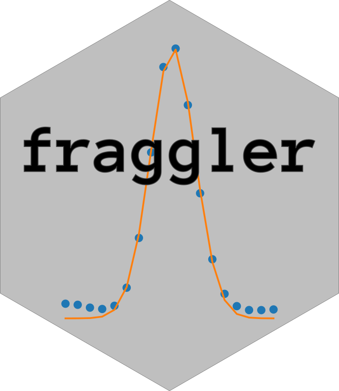

# Fraggler


## Description
Fraggler is a Python package that provides functionality for analyzing and generating reports for fsa files. It offers both a Python API and a command-line tool for ease of use.

----------------

### Features
`Peak Area Report Generation`: Fraggler allows you to generate peak area reports for all input files. The package calculates peak areas based on specified parameters and generates a report summarizing the results.

`Combined Peak Table Generation`: Fraggler provides a command-line tool to generate a combined dataframe of peaks for all input files. This allows you to easily analyze and compare peaks across multiple files.

`Customization Options`: Fraggler offers various customization options to tailor the analysis to your specific needs. You can specify parameters such as ladder type, peak model, minimum ratio, minimum height, cutoff value, trace channel, peak height, and even provide a custom peaks file for specific assays and intervals.

## Install

```bash
git clone git@github.com:willros/ladder_map.git && cd ladder_map
pip install .
```
Or via conda:
```
conda install -c bioconda fraggler
```

## Usage

To get an overview how the library can be used in a python environment, please look at `tutorial.ipynb`.


## CLI Tool Example Usage:
### Fraggler report

#### Usage
To generate a peak area report for all input files, use the fraggler report command followed by the required positional arguments and any optional flags.


```console
fraggler report IN_PATH OUT_FOLDER <flags>
```
#### Description
The fraggler report command generates a peak area report for all input files.


#### Positional Arguments
The following positional arguments are required:

- `IN_PATH`: Type `str`. Specifies the input path.
- `OUT_FOLDER`: Type `str`. Specifies the output folder.

#### Flags
The following flags can be used with the `fraggler report` command:

- `-l, --ladder=LADDER`: Type `str`. Specifies the ladder. Default value: 'LIZ'.
- `--peak_model=PEAK_MODEL`: Type `str`. Specifies the peak model. Default value: 'gauss'.
- `--min_ratio=MIN_RATIO`: Type `float`. Specifies the minimum ratio. Default value: 0.3.
- `--min_height=MIN_HEIGHT`: Type `int`. Specifies the minimum height. Default value: 100.
- `--cutoff=CUTOFF`: Type `int`. Specifies the cutoff value. Default value: 175.
- `-t, --trace_channel=TRACE_CHANNEL`: Type `str`. Specifies the trace channel. Default value: 'DATA9'.
- `--peak_height=PEAK_HEIGHT`: Type `int`. Specifies the peak height. Default value: 200.
- `--custom_peaks=CUSTOM_PEAKS`: Type `Optional[str]`. Specifies custom peaks. Default value: None.

#### Typical usage
```console
fraggler report folder report_folder --min_height=30 -t=DATA1 
```

### Fraggler peak_table

#### Usage

This project provides a command-line tool, `fraggler peak_table`, that generates a combined dataframe of peaks for all input files.

```console
fraggler peak_table IN_PATH OUT_NAME <flags>
```
#### Description
The fraggler peak_table command generates a combined peak_table for all input files.

- If not specified, fraggler finds peaks agnostic in the `fsa file`. To specifiy custom assays with certain peaks and intervals, the user can add a .csv file to the `--custom_peaks` argument. The csv file MUST have the following shape:

| name | start | stop | amount |
|---|---|---|---|
| prt1 | 140 | 150 | 2 |

If `amount` if left emtpy, `fraggler` will take all peaks inside the interval. If amount is not empty, fraggler will include the top `N` peaks in the interval, based on height.

#### Positional Arguments
The following positional arguments are required:

- `IN_PATH`: Type: `str`
- `OUT_NAME`: Type: `str`

#### Flags
The following flags can be used with the `fraggler peak_table` command:

- `-l, --ladder=LADDER`: Type: `str`, Default: 'LIZ'
- `--peak_model=PEAK_MODEL`: Type: `str`, Default: 'gauss'
- `--min_height=MIN_HEIGHT`: Type: `int`, Default: 100
- `--cutoff=CUTOFF`: Type: `int`, Default: 175
- `--min_ratio=MIN_RATIO`: Type: `float`, Default: 0.3
- `-t, --trace_channel=TRACE_CHANNEL`: Type: `str`, Default: 'DATA9'
- `--peak_height=PEAK_HEIGHT`: Type: `int`, Default: 200
- `--custom_peaks=CUSTOM_PEAKS`: Type: `Optional[str]`, Default: None
- `-e, --excel=EXCEL`: Type: `bool`, Default: False

#### Typical usage
```console
fraggler peak_table \
fsa_folder \
out_file \
--min_height=30 \
-t=DATA1 \
--excel=True \
--custom_peaks=peaks.csv 
```


